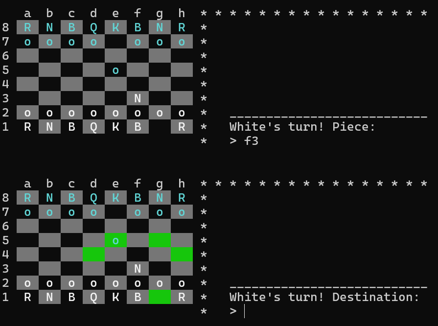

# TerminalChess (work in progress)
Play chess using notation. Make a move by first typing the square where the piece you want to move is located, followed with the destination square. To castle king-side, enter *0-0* and to castle queen-side, enter *0-0-0*.

Ex) *e2* + Enter selects the piece located at *e2*, the *e4* + Enter moves the piece to *e4*.

## Building and running:
1. Add path to project at the end of [build_template](./build_template.sh)
2. ```./build_template.sh``` in project directory
3. ```./chess```

## Preview:


## To do:
- Game over scenarios (checkmate, stalemate and draw)
- Castling
- En passant
- Chessengine (minimax algorithm)